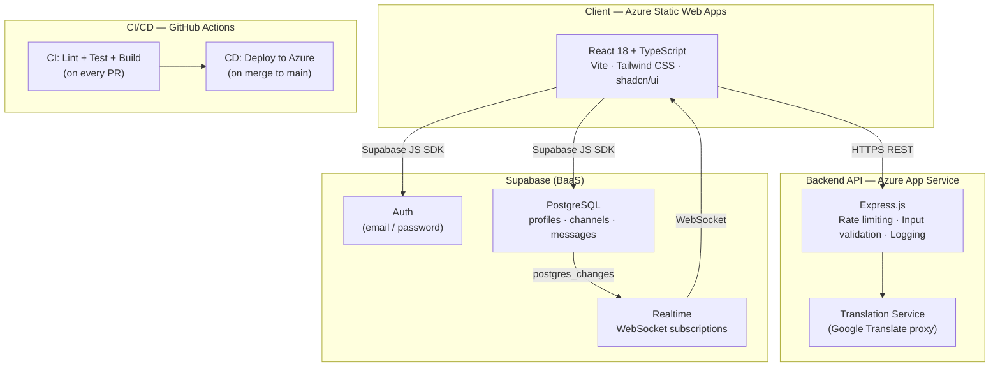

# 🌍 Time Chat Translator


> A real-time multilingual chat platform. Users write in their native language — everyone reads in theirs. Instant. Automatic. Global.

---

## ✨ Features

- **Real-time messaging** via Supabase Realtime (WebSockets)
- **Automatic translation** into 10 languages (EN, FR, ES, DE, IT, PT, RU, JA, ZH, AR)
- **Toggle original/translated** message on click
- **Multi-channel** organization (35+ topic channels)
- **Secure authentication** — email/password via Supabase Auth
- **Row-Level Security** on all database tables

---

## 🏗️ Architecture



---

## 🗄️ Database Schema

```
auth.users (Supabase managed)
    │
    ├── profiles    (id, username, avatar_url, status, last_seen)
    │
    ├── channels    (id, name, description, created_by → profiles)
    │
    └── messages    (id, content, user_id → auth.users, channel_id → channels)
```

All tables use **Row-Level Security (RLS)** — users can only read/write their own data.

---

## 🚀 Getting Started

### Prerequisites

- Node.js 20+
- Docker & Docker Compose
- A [Supabase](https://supabase.com) project

### 1. Clone the repo

```bash
git clone https://github.com/stefanwakata/Time-chat-translator.git
cd Time-chat-translator
```

### 2. Configure environment variables

```bash
cp .env.example .env
# Fill in your Supabase credentials
```

`.env.example`:
```env
VITE_SUPABASE_URL=https://your-project.supabase.co
VITE_SUPABASE_PUBLISHABLE_KEY=sb_publishable_...
VITE_API_URL=http://localhost:3001
SUPABASE_SERVICE_KEY=eyJ...
```

### 3a. Run with Docker (recommended)

```bash
docker compose up --build
```

- Frontend → http://localhost:8080
- Backend API → http://localhost:3001/health

### 3b. Run locally (development)

```bash
# Terminal 1 — Frontend
cd "Time chat translator"
npm install && npm run dev

# Terminal 2 — Backend API
cd backend
npm install && npm run dev
```

---

## 🧪 Tests

```bash
# Frontend — Vitest + React Testing Library
cd "Time chat translator"
npm run test:ci

# Backend — Vitest + Supertest
cd backend
npm run test:ci
```

---

## 🔬 CI/CD Pipeline

Every pull request triggers:

1. **ESLint** — static analysis on frontend & backend
2. **Vitest** — unit + integration tests with coverage
3. **TypeScript** — strict type checking
4. **Docker** — validates the multi-stage image builds

On merge to `main`:

5. **Azure Static Web Apps** — frontend deployed automatically
6. **Azure App Service** — backend deployed automatically

---

## 🔐 Security

- Secrets managed via **GitHub Actions Secrets** and `.env` (never committed)
- **Helmet.js** — hardened HTTP response headers
- **Rate limiting** — 100 req/15min globally, 30 req/min on translation
- **Zod** — input validation on all API endpoints
- **CORS** — restricted to known origins
- **Docker** — containers run as non-root user

---

## 🗂️ Project Structure

```
Time-chat-translator/
├── Time chat translator/       # React frontend (Vite + TypeScript)
│   ├── src/
│   │   ├── components/         # UI components (MessageBubble, ChatHeader…)
│   │   ├── pages/              # Route pages
│   │   ├── integrations/       # Supabase client & generated types
│   │   └── __tests__/          # Vitest component tests
│   ├── Dockerfile              # Multi-stage build → nginx
│   ├── nginx.conf              # Production nginx config
│   └── vitest.config.ts
│
├── backend/                    # Express.js API (TypeScript)
│   ├── src/
│   │   ├── routes/             # /api/translate
│   │   ├── middleware/         # Rate limiter, Winston logger
│   │   └── __tests__/          # Supertest integration tests
│   └── Dockerfile              # Multi-stage build → non-root Node
│
├── .github/workflows/
│   ├── ci.yml                  # CI: lint + test + build
│   └── cd-azure.yml            # CD: deploy to Azure on main
│
├── docker-compose.yml          # Local full-stack development
└── README.md
```

---

## 🌐 Tech Stack

| Layer | Technology |
|---|---|
| Frontend | React 18, TypeScript, Vite, Tailwind CSS, shadcn/ui |
| Backend | Node.js 20, Express.js, TypeScript |
| Database | PostgreSQL (via Supabase) |
| Auth | Supabase Auth |
| Realtime | Supabase Realtime (WebSockets) |
| Translation | Google Translate API (proxied & rate-limited via backend) |
| Testing | Vitest, React Testing Library, Supertest |
| CI/CD | GitHub Actions |
| Cloud | Azure Static Web Apps + Azure App Service |
| Containers | Docker (multi-stage), nginx |

---

## 👤 Author

**Stefan Olivier Wakata**
- GitHub: [@stefanwakata](https://github.com/stefanwakata)
- LinkedIn: [Stefan Wakata](https://www.linkedin.com/in/stefan-wakata-1610b6243/)
- Email: stefanwakata45@gmail.com
